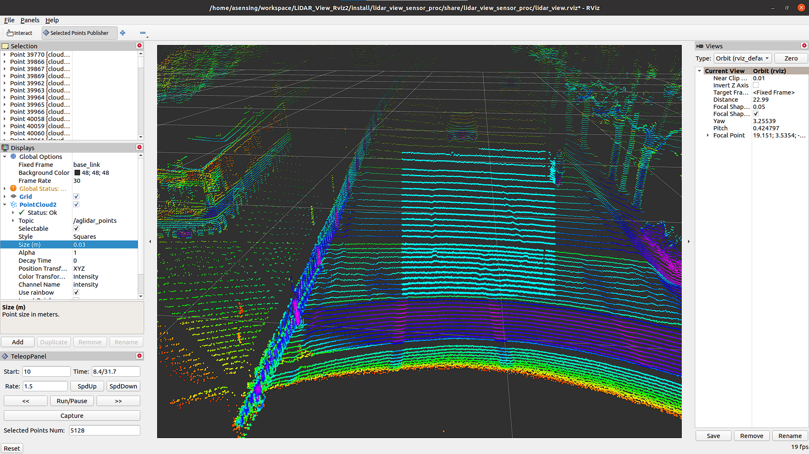

# LiDAR_View_Rviz2

## 介绍

LiDAR View Rviz2 plugin 是基于 ROS2 rviz2 开发的可视化插件，支持以下功能：

- 常规点云播放
- 播放 / 暂停
- 倍速 / 慢速播放
- 点云帧捕捉并保存pcd
- 单帧前进 / 后退
- 当前时间与数据包总时长显示
- 点云框选点数显示

## 支持平台

目前仅在 3 个 ROS2 版本上编译过

- foxy
- galactic
- humble

## 运行

导入环境变量，以 Galactic 版本为例

```shell
source /opt/ros/galactic/setup.bash
```

编译

```shell
colcon build
source install/setup.bash
```

启动，执行 run.sh

```shell
./run.sh
```

注意：本插件只支持 ROS2 的 rosbag 数据，在启动之前请修改 lidar_view_sensor_proc/config/config.yaml 文件中的 `file_path` 和 `file_name` 参数，设置 rosbag 的文件路径。

```yaml
lidar_view_sensor_proc_node:
  ros__parameters:
    file_path: "/path/to/your/rosbag"
    file_name: "rosbag2-filename.db3"
    topics: ["/aglidar_points", "/lidar2"]
    frame_ids: ["base_link", "base_link"]
```

如果一切顺利，启动可在 Rviz 上看到左下角增加了一个控制面板，如下所示。



## 功能

TeleopPanel 控制面板的功能说明如下。


## 注意

- `run.sh` 程序运行路径可能不大一样，如果运行报错请检查以下 `lidar_view_sensor_proc_node` 的路径，默认 build 的路径已经设置好。
- `config.yaml` 文件记录的 rosbag 路径 `file_path` 和 `file_name` 也要根据实际情况更新。
- 这个插件需要用到 rosbag，录制点云 rosbag 命令如下：
  ```shell
  ros2 bag record /aglidar_points
  ```

## 参考

- [SelectedPointsPublisher](https://github.com/drwnz/selected_points_publisher.git)
- [TeleopPanel — rviz_plugin_tutorials documentation (ros.org)](https://docs.ros.org/en/hydro/api/rviz_plugin_tutorials/html/panel_plugin_tutorial.html)
- [rosbag/Code API - ROS Wiki](http://wiki.ros.org/rosbag/Code%20API)
